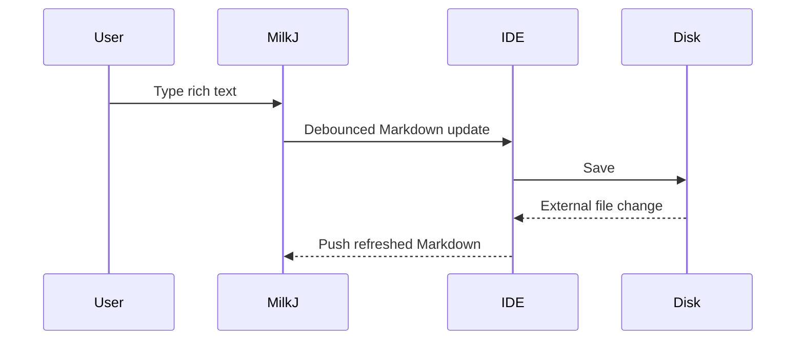

***

title: MilkJ Smoke Test
tags:

* milkj

* markdown

* smoke-test
  status: draft

***

# MilkJ Smoke Test

This file is a compact fixture for testing MilkJ rendering, editing, syncing, and round-trip
Markdown behavior.

Edit freely. Save it, switch to the native Markdown editor, edit there, then switch back to MilkJ.

## Inline Formatting

Plain text with **bold**, _italic_, _**bold italic**_, ~~strikethrough~~, `inline code`, and a
[link to Milkdown](https://milkdown.dev).

Reference links should survive too: [JetBrains](https://www.jetbrains.com).

## Lists

<br />

* First bullet

* Second bullet

  * Nested bullet

  * Another nested bullet with `code`

* Third bullet

1. First ordered item
2. Second ordered item

   1. Nested ordered item
   2. Another nested ordered item
3. Third ordered item

## Task List

```
test
more test
```

* [x] Open this file in MilkJ

* [x] Toggle light and dark mode

* [ ] Edit this checkbox in MilkJ

* [ ] Edit this file from the native Markdown tab

* [ ] Edit this file from a terminal while MilkJ is open

## Blockquote

> A blockquote with **formatting**.
>
> * Quoted list item
>
> * Another quoted item

## Table

| Feature  | Expected | Notes                                |
| -------- | -------: | ------------------------------------ |
| Headings |      Yes | H1/H2/H3 render cleanly              |
| Tables   |      Yes | Alignment should round-trip          |
| Tasks    |      Yes | GFM task list                        |
| Mermaid  |      Yes | Diagram preview plus fenced Markdown |

## Code Fence

```kotlin
fun greet(name: String): String {
    return "Hello, $name"
}

println(greet("MilkJ"))
```

## Mermaid

```Mermaid
flowchart TD
    A[Open Markdown file] --> B{Choose editor tab}
    B -->|MilkJ| C[Edit WYSIWYG]
    B -->|Built-in| D[Edit raw Markdown]
    C --> E[Sync to IntelliJ Document]
    D --> E
    E --> F[Save to disk]
```



## Math

Inline math: $E = mc^2$.

Block math:

$$
\int_0^1 x^2 dx = \frac{1}{3}
$$

## Image

Embedded image:


## Hard Breaks

This line ends with two spaces.\
This should appear directly underneath it.

This line uses a backslash.\
This should also appear directly underneath it.

## HTML Passthrough

<details>
<summary>HTML details block</summary>

Markdown inside HTML blocks can be tricky. This should at least preserve without being destroyed.

</details>

## Nested Stress Case

1. Parent ordered item

   * Mixed nested bullet

     > Quote inside a nested list
     >
     > ```text
     > quoted code fence
     > ```
2. Next ordered item

## Horizontal Rule

***

## Final Edit Area

Use this section for quick manual sync testing.

* MilkJ edit:

* Native editor edit:

* Terminal edit:

